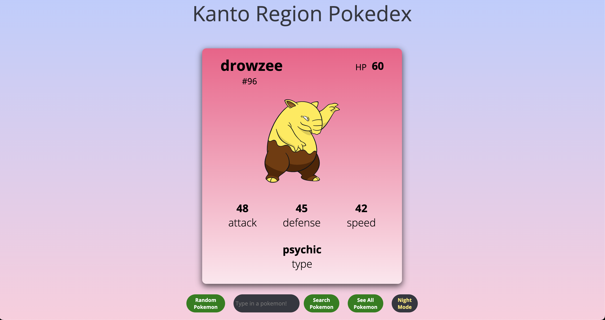
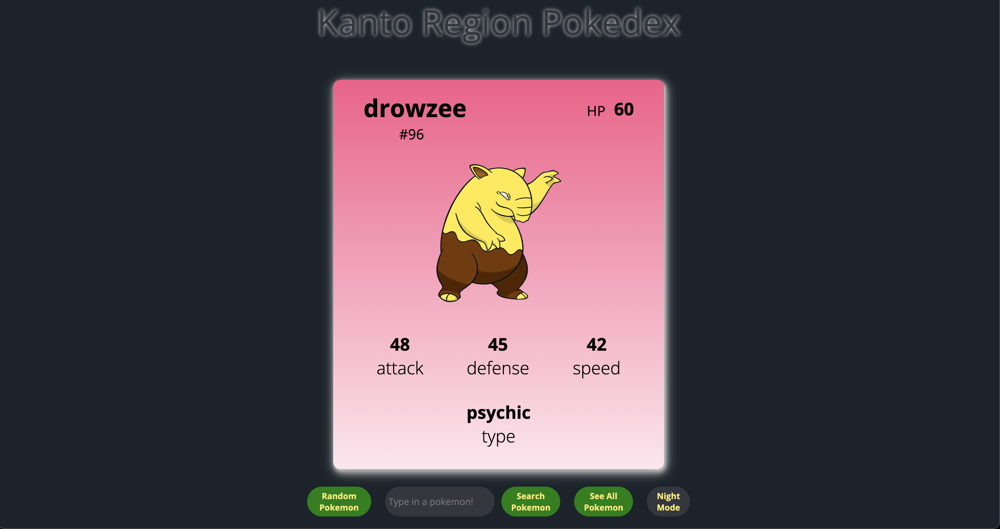
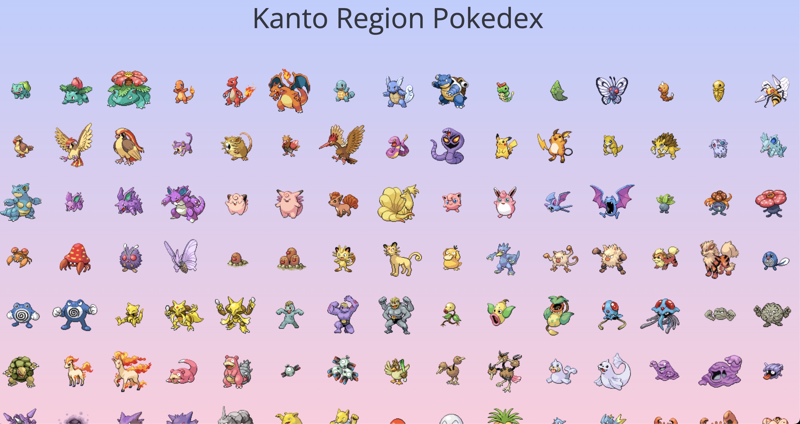
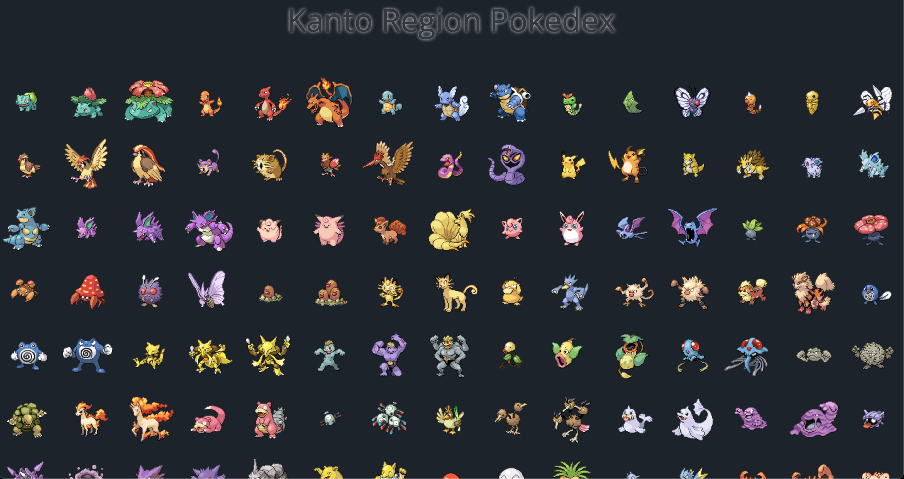

# Kanto Region Pokedex

### Date: 7/7/2022

### By: Kenneth Chan

#### [wireframe](https://wireframe.cc/PCut0Q)

#### [trello](https://trello.com/invite/b/hkmy4OOn/5fe6853cb411fae4a74eccc29920a4ed/kanto-region-pokedex)

---

### **_Description_**

#### For my unit 1 project I decided to create a pokedex utilizing a Pokemon API and comprehension of HTML, CSS and Javascript. The pokemon game series had a huge influence in my childhood/youth. Seeing and hearing Pokemon still grabs the attention of people who grew up playing the games and watching the show. The series still continues to create an impact on younger generations. The pokedex allows the user to reference the stats of the different pokemon. This pokedex allows the user to see a random pokemon, search for a particular pokemon, or see all 151 pokemon. I implemented soft gradient colors to complement the diverse colors and textures of each pokemon.

#### Every API will have their own issues. My biggest hurdle was getting all of the data for all 151 pokemon in (1) call. I found that the Pokemon API had nested url links for each pokemon. To solve this issue I had to make a second API call using axios. On my first call I had extracted each pokemon name and set their names as a variable. On my second API call I appended the pokemon's name variable to the end of the API link which allowed me to access all the data for each Pokemon.

#### I found this project to be an exciting challenge, from making the second axios call, DOM manipulation to styling with CSS. Every API link has their quirks and features, I am content with the results.

---

### **_How To Get Started_**

#### Online Pokedex featuring the first 151 Pokemon from the Kanto region as seen in the games "Pokemon Red", "Pokemon Blue" and "Pokemon Yellow". The entry page features a pokeball that bounces and center button glows red when the mouse hovers over it. Clicking it will let you enter into the main page.

#### The main page has (4) features:

#### -Clicking the "Random Pokemon" button will generate a random Pokemon card. This card displays the Pokemon's name, ID#, HP and stats like attack, defense, speed and type.

#### -Entering a pokemon name or ID# into the search bar and clicking "Search Pokemon" will display the Pokemon along with ID#, HP and stats.

#### -Clicking the "See All Pokemon" button will generate all 151 pokemon in a grid.

#### -Clicking the "Night Mode" button will display a dark background and display a glow from the title, Pokemon Card and yellow heue from the button's text. Click again to return to normal viewing mode.

---

### **_Future Updates_**

#### Modifiy the "See All Pokemon" page to put every Pokemon in their own container that includes name, ID#, HP, Stats.

---

### **_Screenshots_**

---

### **_Credits_**

#### Window Load Event: [MDN](https://developer.mozilla.org/en-US/docs/Web/API/Window/load_event)

#### Dark/Light Mode: [Geeks for Geeks](https://www.geeksforgeeks.org/how-to-create-dark-light-mode-for-website-using-javascript-jquery/)

#### Pokemon Type Hex Colors: [Bulbagarden](https://bulbapedia.bulbagarden.net/wiki/Category:Type_color_templates)

#### Background Gradient: [MDN](https://developer.mozilla.org/en-US/docs/Web/CSS/gradient/linear-gradient)

#### Pokemon Card Gradient: [CSS gradient](https://cssgradient.io/)

#### Pokemon A Button Sounds: [Soundboard](https://soundboardguy.com/sounds/pokemon-a-button/)

#### Bouncing Animation: [Youtube](https://www.youtube.com/watch?v=drsUJIBKdXk&ab_channel=CodingArtist)
